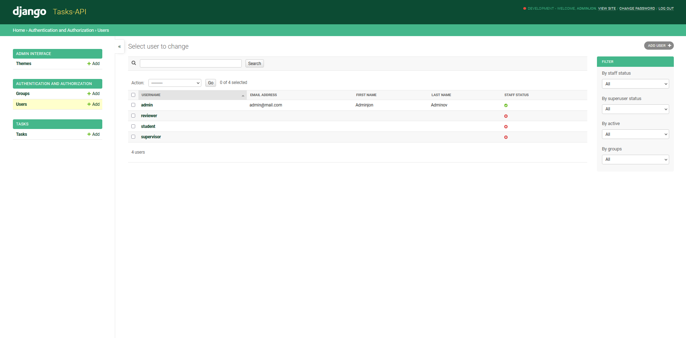
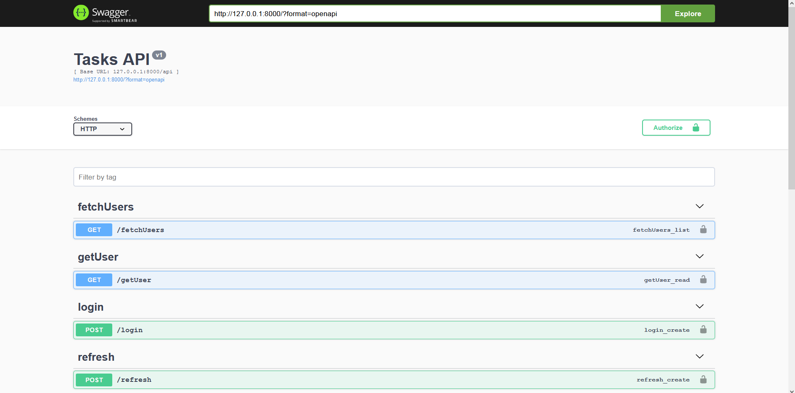
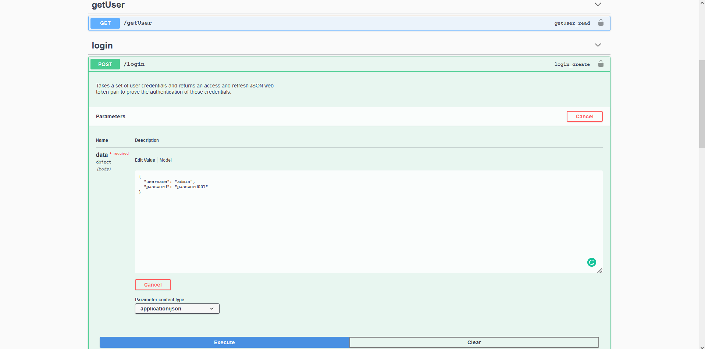
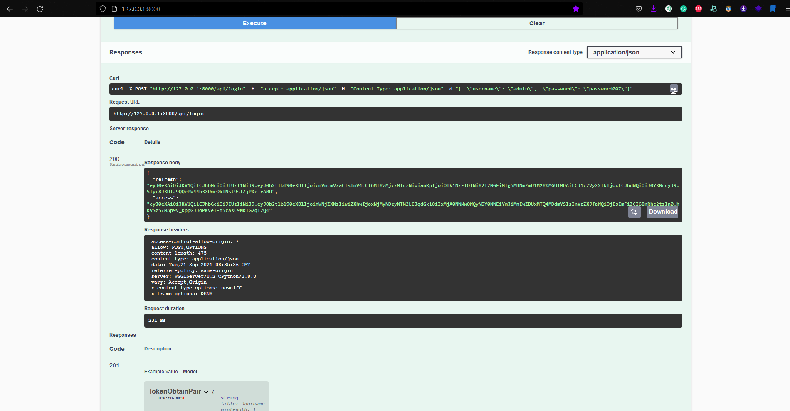
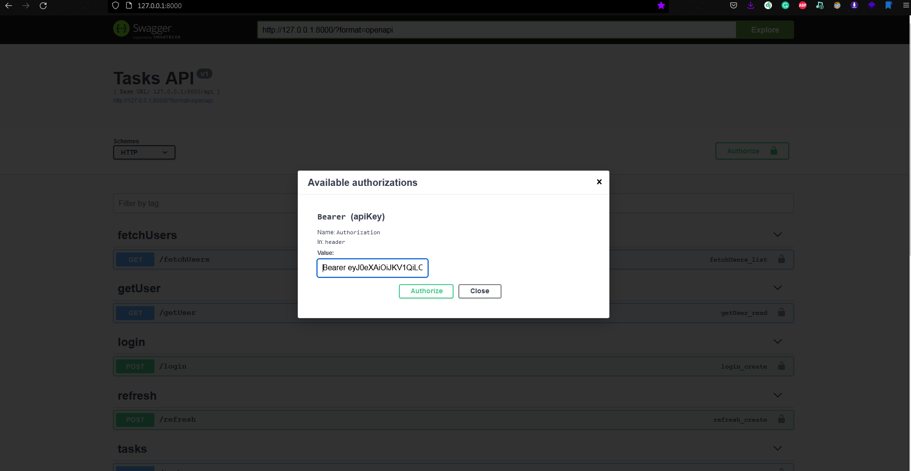
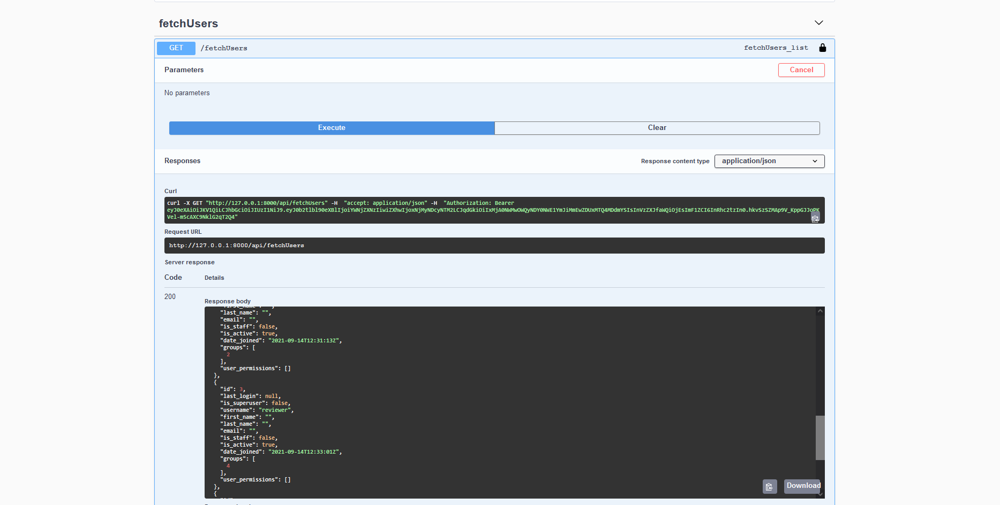

# **Tasks-API**



> _Simple API for managing tasks (written in DRF)_

### **Setup**

Clone this repo:

```bash
$ git clone https://github.com/AbduazizZiyodov/tasks-api.git
```

Create virtual environment(+activate it):

```bash
# env/bin/activate for linux
# env/Scripts/activate for windows(git-bash)

$ python -m venv env && source env/Scripts/activate
```

Install all depences for this project using `pip`:

```bash
$ pip install -r requirements.txt
```

> P.S You need not migrate databases or create users. All of these are done for you.

You should run command `collectstatic` from `manage.py` for collecting django's static files.

```bash
$ python manage.py collectstatic
```

### **Running Server**

Using `manage.py`:

```bash
$ python manage.py runserver
```

There are three diffrent user roles for managing task.

Roles and Permissions for tasks:

- **Student**

  - `READ`
  - `CREATE`
  - `UPDATE`
  - `DELETE`

- **Supervisor**
  - `READ`
  - `CREATE`
  - `UPDATE`
- **Reviewer**
  - `READ`
- **Admin** - `sudo` _:)_

> **Usernames**:
>
> - `student`
> - `supervisor`
> - `reviewer`
> - `admin`

> Password is **password007**

Screenshots:

- Home Page (`Swagger UI`)
  

- Login (from UI) -
  you can get `JWT(access)` token from this endpoint
  

- Copy this `access` token bro:
  

- Authorization by `Swagger`:
  

> **NOTE:** `Bearer jwt_token`

- Test it:
  

### **API Reference**

#### **Users**

`api/login`

> Get your jwt token from here

- **Request**:
  - method - `POST`
  - body:
    ```json
    {
      "username": "string",
      "password": "string"
    }
    ```
- **Response**:
  - body:
    ```json
    {
      "refresh": "string",
      "access": "sting"
    }
    ```

`api/refresh`

> Refresh jwt token from here if your jwt is expired

- **Request**:
  - method - `POST`
  - body:
    ```json
    {
      "refresh": "string"
    }
    ```
- **Response**:
  - body:
    ```json
    {
      "access": "string"
    }
    ```

`api/getUser`

> Returns user info by jwt token in auth header

- **Request**:

  - method - `GET`
  - body: `-`
  - header: `Authorization Bearer`

- **Response**:

  - body:

  ```json
  {
    "id": 0,
    "password": "string",
    "last_login": "2021-09-21T09:37:24.858Z",
    "is_superuser": true,
    "username": "string",
    "first_name": "string",
    "last_name": "string",
    "email": "user@example.com",
    "is_staff": true,
    "is_active": true,
    "date_joined": "2021-09-21T09:37:24.858Z",
    "groups": [0],
    "user_permissions": [0]
  }
  ```

<hr>

`api/fetchUsers`

> Returns ALL information about USERS.

- **Request**:
  - method - `GET`
  - body: `-`
  - header: `Authorization Bearer`
  - required user group: `sudo`
- **Response**:
  - body:
  ```json
  [
    {
      "id": 0,
      "password": "string",
      "last_login": "2021-09-21T09:37:24.854Z",
      "is_superuser": true,
      "username": "string",
      "first_name": "string",
      "last_name": "string",
      "email": "user@example.com",
      "is_staff": true,
      "is_active": true,
      "date_joined": "2021-09-21T09:37:24.854Z",
      "groups": [0],
      "user_permissions": [0]
    }
  ]
  ```

#### **Tasks**

`api/tasks`

> List of all tasks

- **Request**:
  - method - `GET`
  - body:`-`
  - header: `Authorization Bearer`
  - required READ permission (see groups and their permissions given above)
- **Response**:
  - body:
  ```json
  [
    {
      "id": 0,
      "title": "string",
      "description": "string",
      "user": {
        "id": 0,
        "password": "string",
        "last_login": "2021-09-21T09:37:24.854Z",
        "is_superuser": true,
        "username": "string",
        "first_name": "string",
        "last_name": "string",
        "email": "user@example.com",
        "is_staff": true,
        "is_active": true,
        "date_joined": "2021-09-21T09:37:24.854Z",
        "groups": [0],
        "user_permissions": [0]
      },
      "created_at": "2021-09-21T09:03:04.626Z"
    }
  ]
  ```

<hr>

`api/tasks/create`

> You can create New Task

- **Request**:
  - method - `POST`
  - body:
  ```json
  {
    "title": "string",
    "description": "string",
    "user": 0 //user's primary key
  }
  ```
  - header: `Authorization Bearer`
  - required CREATE permission (see groups and their permissions given above)
- **Response**:
  - body:
  ```json
  {
    "id": 0,
    "title": "string",
    "description": "string",
    "created_at": "2021-09-21T09:01:11.442Z",
    "user": 0
  }
  ```

<hr>

`api/tasks/<int:pk>`

> You can get Task by its pk

- **Request**:
  - method - `GET`
  - body: `-`
  - header: `Authorization Bearer`
  - required READ permission (see groups and their permissions given above)
- **Response**:
  - body:
  ```json
  {
    "id": 0,
    "title": "string",
    "description": "string",
    "user": {
      "id": 0,
      "password": "string",
      "last_login": "2021-09-21T09:37:24.854Z",
      "is_superuser": true,
      "username": "string",
      "first_name": "string",
      "last_name": "string",
      "email": "user@example.com",
      "is_staff": true,
      "is_active": true,
      "date_joined": "2021-09-21T09:37:24.854Z",
      "groups": [0],
      "user_permissions": [0]
    },
    "created_at": "2021-09-21T09:03:04.626Z"
  }
  ```

<hr>

`api/tasks/<int:pk>/update`

> You can update Task by its pk

- **Request**:
  - method - `PUT|PATCH`
  - body:
  ```json
  {
    "title": "string",
    "description": "string",
    "user": 0
  }
  ```
  - header: `Authorization Bearer`
  - required UPDATE permission (see groups and their permissions given above)
- **Response**:
  - body:
  ```json
  {
    "id": 0,
    "title": "string",
    "description": "string",
    "created_at": "2021-09-21T09:06:28.044Z",
    "user": 0
  }
  ```
  <hr>

`api/tasks/<int:pk>/delete`

> You can delete Task by its pk

- **Request**:
  - method - `DELETE`
  - body: `-`
  - header: `Authorization Bearer`
  - required DELETE permission (see groups and their permissions given above)
- **Response**:
  - body: `-`
